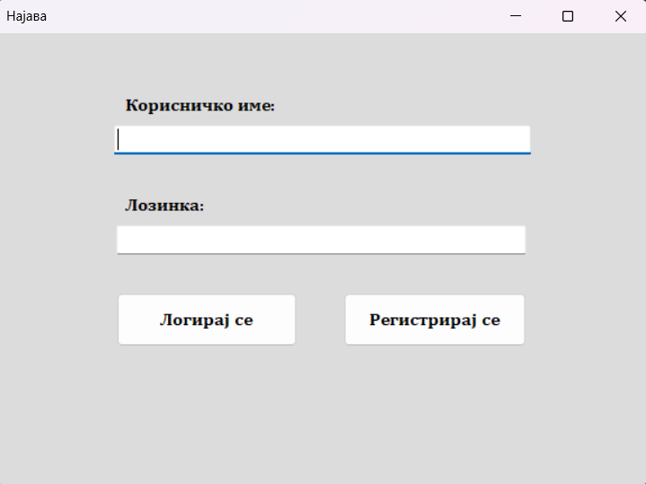
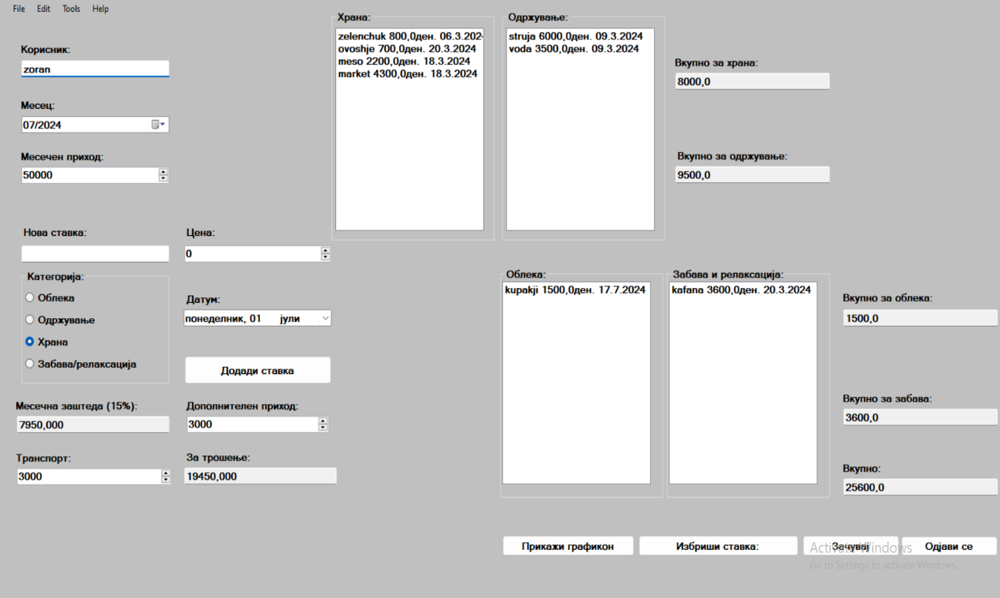
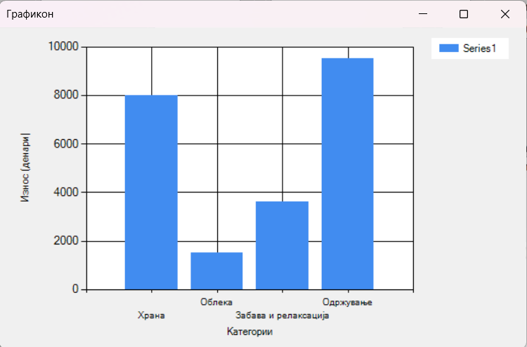
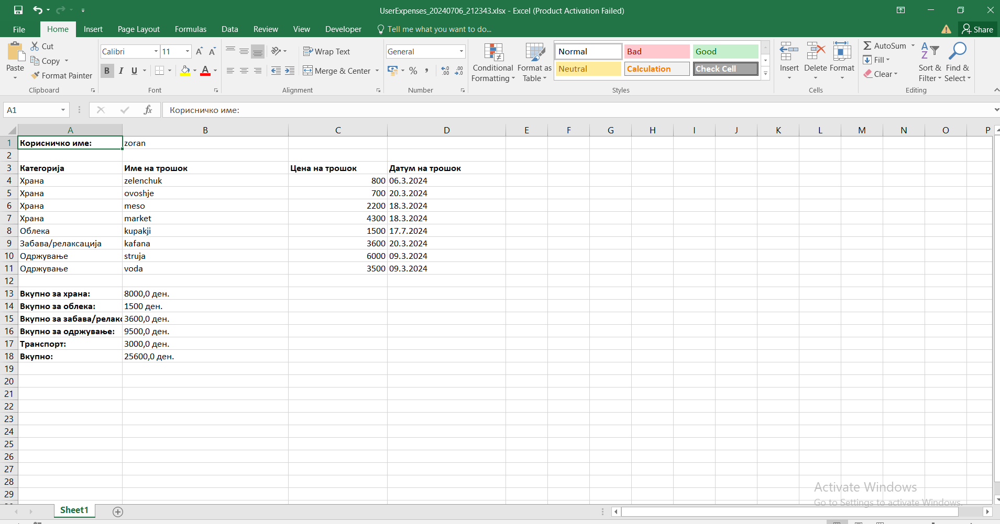

## Опис на Апликацијата
Апликацијата Личен Финансиски Планер е наменета за управување со личните финансии на корисниците. Апликацијата овозможува корисниците да ги следат нивните приходи, трошоци и заштеди на месечна основа, да генерираат извештаи и графици, и да ги извезуваат податоците во Excel формат. Апликацијата е развиена во C# користејќи Visual Studio.

## Функционалности
•	Корисничка автентикација: Логирање и регистрација на корисници со безбедносни мерки.
•	Следење на трошоци: Додавање, уредување и бришење на трошоци по категории (храна, облека, забава, комунални трошоци, транспорт).
•	Месечни приходи и заштеди: Поставување и ажурирање на месечни приходи и заштеди.
•	Извештаи и визуелизација: Генерирање графици и извештаи за финансиските податоци.
•	Извоз на податоци: Извоз на финансиски податоци во Excel формат.

## Цел на Апликацијата
Апликацијата служи за помош на корисниците да имаат подобар преглед и контрола над нивните финансии, овозможувајќи им да ги следат нивните трошоци и заштеди, и да донесуваат информирани одлуки за подобро управување со личните финансии.

### Опис на Решението

**Структура на Податоци**
Податоците во апликацијата се организирани во JSON формат и се чуваат локално. Клучни класи и структури вклучуваат:
•	User: Класа која ги содржи основните информации за корисникот, вклучувајќи ги корисничкото име и лозинка, како и податоците за финансиската состојба (UserData).
•	UserData: Класа која ги содржи финансиските податоци за корисникот, организирани по категории на трошоци (храна, облека, забава, комунални трошоци, транспорт), како и информации за месечни приходи, заштеди и износ за трошење.
•	ExpenseItem: Класа која ги содржи податоците за поединечен трошок, како име, износ и датум.

**Класи за управување со податоците**
Една од најважните класи за оваа апликација е класата UserData. Истата ги содржи сите информации за финансиите на еден корисник (приходи, заштеди и торшоци).
  public class UserData
  {
      public List<ExpenseItem> FoodExpenses { get; set; }
      public List<ExpenseItem> ClothesExpenses { get; set; }
      public List<ExpenseItem> EntertainmentExpenses { get; set; }
      public List<ExpenseItem> UtilityExpenses { get; set; }
      public decimal MonthlyIncome { get; set; }
      public decimal AdditionalIncome { get; set; }
      public decimal MonthlySavings { get; set; }
      public decimal SpendableAmount { get; set; }
      public decimal TransportCost { get; set; }

      public UserData()
      {
          FoodExpenses = new List<ExpenseItem>();
          ClothesExpenses = new List<ExpenseItem>();
          EntertainmentExpenses = new List<ExpenseItem>();
          UtilityExpenses = new List<ExpenseItem>();
      }
  }

**Функција за Додавање на Трошок:  btnAddExpense_Click**

Оваа функција се повикува кога корисникот ќе кликне на копчето "Додади ставка" во апликацијата. Таа овозможува додавање на нов трошок во соодветната категорија и ажурирање на поврзаните податоци.
1.	Преземање на Внесените Податоци:
•	expenseName - Име на трошокот, земено од текстуалното поле txtExpenseName.
•	expenseDate - Датум на трошокот, земен од контролата за избор на датум dtpExpenseDate.
•	expenseAmount - Износ на трошокот, земен од нумеричката контрола nudExpenseAmount.
2.	Валидација на Внесените Податоци:
•	Проверува дали е внесено име за трошокот. Ако не е, прикажува порака и ја прекинува функцијата.
•	Проверува дали износот на трошокот е валиден (поголем од 0). Ако не е, прикажува порака и ја прекинува функцијата.
•	Проверува дали е избрана категорија за трошокот. Ако не е, прикажува порака и ја прекинува функцијата.
•	Проверува дали има доволно пари за трошење. Ако нема, прикажува порака и ја прекинува функцијата.
3.	Креирање на Нов Трошок:
•	Креира нов објект ExpenseItem со внесените податоци.
4.	Додавање на Трошокот во Соодветната Категорија:
•	Според избраната категорија, го додава новиот трошок во соодветната листа на трошоци (FoodExpenses, ClothesExpenses, EntertainmentExpenses, UtilityExpenses).
•	Ги ажурира соодветните контроли на корисничкиот интерфејс (ListBox и Category Total).
5.	Зачувување и Ажурирање на Податоците:
•	Ги зачувува податоците за тековниот корисник и повторно ги вчитува за ажурирање на корисничкиот интерфејс.
•	SaveUserData(); LoadUserData(); UpdateOverallTotal();

6.	Ресетирање на Формата:
•	Ги ресетира текстуалното поле и нумеричката контрола за следниот внес на трошок.
•	Ги брише селектираните радио копчиња за категорија

### Упатство за користење:

•	При стартување на апликацијата најпрво се појавува формата за најава на корисникот
•	Доколку корисникот се најавува по првпат:
o	Ако корисникот се обиде да притисне на копчето „Логирај се”, претходно не е регистриран на апликацијата, ќе се појави порака: "Не постои корисник со тоа корисничко име.".
o	Потребно е корисникот да притисне на копчето „Регистрирај се” со што ќе биде регистриран во системот, а потоа може веднаш да притисне на копчето „Логирај се” и ќе се најави, без притоа да треба одново да ги внесува податоците.

•	Доколку корисникот е веќе регистриран:
o	Корисникот ги внесува своите податоци и кликнува на копчето „Логирај се”.

•	По најавата се отвора главната формакоја ги содржи податоците за корисникот.
•	Формата содржи:
o	Поле во кое го пишува корисничкото име на логираниот корисник
o	DateTimePicker кој му овозможува на корисникот да го одбере соодветно месецот за кој сака да внесува податоци
o	NumericUpAndDown – служи за внесување на (главниот) месечен приход
o	 4 листи, секоја за соодветната категорија на трошок
o	Поле за внесување на нова ставка во некоја од листите. Една ставка се додава со: Име, Категорија (Radio buttons), Цена и Датум. Потоа се притиска копчето Додади ставка по што ставката се додава во соодветната категорија.
o	Поле за Месечна заштеда. Месечната заштеда е 15% од (месечен приход+дополнителен приход)
o	Поле за дополнителен приход – корисникот внесува доколку има дополнителен приход во месецот (дивиденда, ДДВ, стипендија и сл.)
o	Поле за транспорт – корисникот внесува колку пари е потребно за транспорт (бензин, слободна карта и сл.)
o	Поле „За трошење” во кое остануваат средствата кои корисникот ги има на располагање откако ќе се одземе заштедата и транспортот. Доколку ова поле е помало по вредност од цената на новата ставка, на екранот се појавува порака за недоволно средства.
o	Од листите може да се избрише ставка со селектирање на истата и притискање на копчето „Избриши ставка“
o	4 полиња – секое го содржи вкупниот трошок од секоја категорија
o	Поле за Вкупно потрошени средства (вклучувајќи ги и оние за транспорт)
o	При притискање на копчето „Зачувај” се зачувуваат податоците за корисникот
o	При притискање на копчето „Одјави се” корисникот потврдува дали сака да се одјави од апликацијата по што формата со податоци се исклучува и се враќа на формата за најава

•	При притискање на копчето „Прикажи графикон” се појавува нова форма со графикон кој ги содржи податоците за трошоци од секоја категорија

•	Исто така во формата е достапна опцијата „Save as”  Excel со што податоците од главната форма се зачувуваат како Excel документ 

